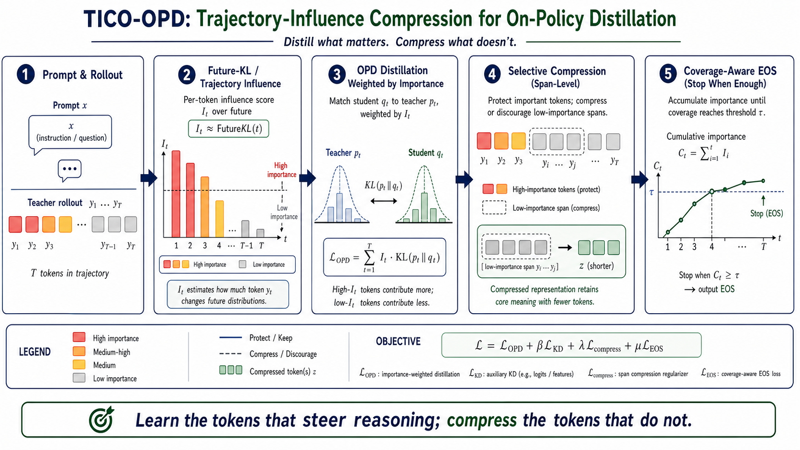
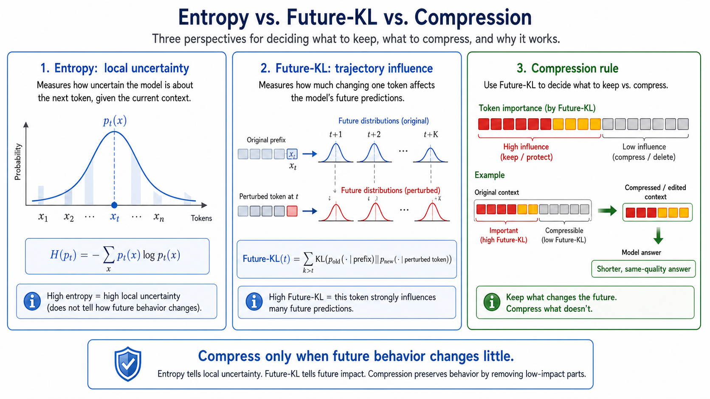

# TICO-OPD

**Trajectory-Influence Compression for On-Policy Distillation**

TICO-OPD is an experimental extension to `slime` OPD that uses Future-KL-style token credit assignment to distill the tokens that steer reasoning, while applying compression pressure only to low-influence continuation tokens.

```text
Distill what changes the trajectory.
Compress what does not.
```



## Why TICO-OPD

Normal on-policy distillation is good at preserving teacher behavior, but it often inherits the teacher's verbosity:

```text
teacher long answer -> student learns long answer
```

TICO-OPD changes the training signal from sequence-level imitation to trajectory-aware token credit assignment:

```text
teacher rollout
  -> estimate which tokens influence future behavior
  -> distill high-influence tokens more strongly
  -> discourage low-influence continuation tokens
  -> encourage EOS after enough important content is covered
```

The goal is not blind length reduction. The goal is **behavior-preserving compression**:

```text
same useful reasoning behavior, fewer unnecessary tokens
```

## Core Idea

For each response token `y_t`, TICO-OPD estimates an importance score:

```text
I_t ~= Future-KL(t)
```

High `I_t` means changing that token is likely to change later model behavior. These tokens are protected and receive stronger distillation.

Low `I_t` means the token is likely to be filler, repeated explanation, formatting, or a low-value continuation. These tokens become compression candidates.

The training-side shaping is:

```text
A'_t = A_t
     - lambda * (1 - I_t) * compressible_t
     + eos_bonus_t
```

where `compressible_t` becomes active after a length budget or after cumulative importance coverage is high.



## What Is Implemented

This repo contains a patch-style implementation for `slime`.

### 1. Future-KL Policy Loss

Enable with:

```bash
--policy-loss-type future_kl
```

This reweights the policy objective with a discounted future trajectory signal.

Code:

```text
slime/utils/ppo_utils.py
  compute_future_token_importance(...)
  compute_future_kl_policy_loss(...)

slime/backends/megatron_utils/loss.py
  policy_loss_type == "future_kl"
```

### 2. Compression-Aware OPD

Enable with:

```bash
--use-compression-opd
```

This applies selective compression pressure after advantages are computed:

```text
high-importance token -> protect
low-importance token beyond budget -> penalize continuation
coverage high -> encourage stopping
coverage low -> avoid premature EOS
```

Code:

```text
slime/backends/megatron_utils/loss.py
  apply_compression_opd_to_advantages(...)

slime/rollout/on_policy_distillation.py
  reward_func(...)
  post_process_rewards(...)
```

### 3. OPD Teacher Logprob Plumbing

Teacher logprobs are extracted during OPD rollout post-processing and stored on each sample:

```text
sample.teacher_log_probs
sample.loss_mask
sample.metadata["compression_importance_mean"]
sample.metadata["compression_low_importance_tokens"]
```

Safety detail: if teacher logprobs do not cover the full response, missing positions are masked out instead of being treated as valid zero-logprob supervision.

Code:

```text
slime/rollout/on_policy_distillation.py
  _fit_response_log_probs(...)
```

### 4. CLI Arguments

All new arguments are wired through:

```text
slime/utils/arguments.py
```

Main switches:

```bash
--policy-loss-type future_kl
--use-compression-opd
--compression-length-budget-ratio
--compression-coverage-threshold
--compression-advantage-coef
--compression-eos-coef
--compression-reward-coef
```

## Quick Start

Start conservative. This tests trajectory weighting and gentle compression without rollout-side masking:

```bash
--use-opd \
--opd-type sglang \
--opd-kl-coef 1.0 \
--custom-rm-path slime.rollout.on_policy_distillation.reward_func \
--custom-reward-post-process-path slime.rollout.on_policy_distillation.post_process_rewards \
--policy-loss-type future_kl \
--future-kl-decay-rate 32 \
--future-kl-start include_current \
--future-kl-window -1 \
--future-kl-clip-ratio 0.2 \
--future-kl-clip-high-only \
--future-kl-safety-threshold 10.0 \
--eps-clip-c 3.0 \
--use-compression-opd \
--compression-length-budget-ratio 0.75 \
--compression-advantage-coef 0.02 \
--compression-eos-coef 0.01 \
--compression-coverage-threshold 0.90 \
--compression-importance-decay-rate 32 \
--compression-reward-coef 0.0
```

## Qwen3 Math Evaluation

TICO-OPD includes a small math evaluation harness for Qwen3-style reasoning models.

Covered datasets:

```text
AIME24  -> OpenRLHF/aime-2024
AIME25  -> MathArena/aime_2025
MATH500 -> HuggingFaceH4/MATH-500
DAPO17k -> BytedTsinghua-SIA/DAPO-Math-17k, for training prompts
```

Prepare local jsonl files:

```bash
python3 scripts/prepare_math_data.py --name aime24 --out-dir /root/data/math
python3 scripts/prepare_math_data.py --name aime25 --out-dir /root/data/math
python3 scripts/prepare_math_data.py --name math500 --out-dir /root/data/math
python3 scripts/prepare_math_data.py --name dapo17k --out-dir /root/data/math
```

The prepared files use normalized keys:

```json
{"prompt": "...", "label": "...", "source": "dapo17k", "source_dataset": "..."}
```

See [DATA.md](DATA.md) for the exact expected format.

Launch a Qwen3 endpoint with sglang:

```bash
MODEL_SIZE=4B \
CUDA_VISIBLE_DEVICES=0 \
TP=1 \
PORT=30000 \
bash scripts/launch_qwen3_sglang.sh
```

Run AIME24, AIME25, and MATH500 evaluation:

```bash
MODEL=Qwen3-4B \
BASE_URL=http://127.0.0.1:30000/v1 \
N_SAMPLES=16 \
bash scripts/eval_qwen3_math.sh
```

The evaluator uses an OpenAI-compatible `/v1/chat/completions` endpoint and extracts final answers from `\boxed{...}` or common final-answer phrases.

Qwen3 thinking-mode defaults:

```text
temperature = 0.6
top_p       = 0.95
top_k       = 20
min_p       = 0.0
max_tokens  = 16384
```

## Qwen3 TICO-OPD Training Example

The general Qwen3 TICO-OPD training launcher is:

```bash
STUDENT_SIZE=4B \
TEACHER_SIZE=32B \
bash scripts/run_qwen3_tico_opd.sh
```

The compatibility wrapper below is equivalent to `STUDENT_SIZE=4B TEACHER_SIZE=32B`:

```bash
bash scripts/run_qwen3_4b_tico_opd.sh
```

Supported Qwen3 size names:

```text
0.6B
1.7B
4B
4B-Instruct-2507
8B
14B
32B
30B-A3B
235B-A22B
```

Example teacher/student pairs:

```bash
# cheap smoke run
STUDENT_SIZE=1.7B TEACHER_SIZE=8B bash scripts/run_qwen3_tico_opd.sh

# default dense distillation
STUDENT_SIZE=4B TEACHER_SIZE=32B bash scripts/run_qwen3_tico_opd.sh

# stronger MoE teacher
STUDENT_SIZE=8B TEACHER_SIZE=235B-A22B TEACHER_TP=8 bash scripts/run_qwen3_tico_opd.sh
```

Important environment variables:

```bash
SLIME_DIR=/root/slime
MEGATRON_DIR=/root/Megatron-LM
STUDENT_SIZE=4B
TEACHER_SIZE=32B
BASE_MODEL=/root/Qwen3-${STUDENT_SIZE}
TEACHER_MODEL=/root/Qwen3-${TEACHER_SIZE}
TRAIN_DATA=/root/data/math/dapo17k.jsonl
AIME24=/root/data/math/aime24.jsonl
AIME25=/root/data/math/aime25.jsonl
MATH500=/root/data/math/math500.jsonl
SAVE_DIR=/root/checkpoints/qwen3-${STUDENT_SIZE}-tico-opd
NUM_GPUS=8
STUDENT_TP=auto
TEACHER_TP=auto
TEACHER_CUDA_VISIBLE_DEVICES=0,1
USE_EXTERNAL_TEACHER=false
```

This script combines:

```text
DAPO17k training prompts
Qwen3 teacher logprob OPD
Future-KL policy loss
compression-aware OPD shaping
AIME24/AIME25/MATH500 eval hooks
```

Teacher and student do **not** need the same number of GPUs.

Recommended patterns:

```bash
# Same machine, explicit split: teacher on 0-1, slime/Ray sees the rest.
TEACHER_CUDA_VISIBLE_DEVICES=0,1 \
TEACHER_TP=2 \
STUDENT_SIZE=4B \
TEACHER_SIZE=32B \
bash scripts/run_qwen3_tico_opd.sh

# Separate teacher service, often best for large teachers.
USE_EXTERNAL_TEACHER=true \
TEACHER_URL=http://teacher-host:13141/generate \
STUDENT_SIZE=4B \
TEACHER_SIZE=235B-A22B \
bash scripts/run_qwen3_tico_opd.sh
```

The student-side GPU layout is controlled by:

```text
NUM_GPUS
ACTOR_NUM_GPUS
ROLLOUT_NUM_GPUS
STUDENT_TP
ROLLOUT_GPUS_PER_ENGINE
MAX_TOKENS_PER_GPU
```

The teacher-side GPU layout is controlled independently by:

```text
TEACHER_TP
TEACHER_CUDA_VISIBLE_DEVICES
TEACHER_MEM_FRACTION_STATIC
USE_EXTERNAL_TEACHER
TEACHER_URL
```

Then increase compression gradually:

```bash
--compression-length-budget-ratio 0.60 \
--compression-advantage-coef 0.05 \
--compression-eos-coef 0.02 \
--compression-reward-coef 0.02
```

Only enable hard low-importance masking after quality is stable:

```bash
--compression-mask-low-importance-tokens \
--compression-low-importance-threshold 0.2
```

## Important Parameters

`--future-kl-decay-rate`

Controls how much future positions contribute to each token's influence score. Larger values make the signal consider a longer future horizon.

`--future-kl-start`

Controls whether the current token contributes to its own future score. `include_current` is usually the first setting to try.

`--compression-length-budget-ratio`

Starts compression pressure after a fraction of the response length. `0.75` means the first 75% of the response is mostly protected from length pressure.

`--compression-coverage-threshold`

Encourages stopping after cumulative importance coverage is high, such as `0.90`.

`--compression-advantage-coef`

Strength of training-side low-importance continuation penalty.

`--compression-eos-coef`

Strength of coverage-aware EOS shaping.

`--compression-reward-coef`

Optional rollout-side scalar penalty for low-importance continuation tokens.

## Metrics to Watch

Track these together:

```text
train/policy_loss
train/future_kl_importance
train/compression_importance
train/compression_penalty
response_length
task reward / eval accuracy
```

Healthy early behavior:

```text
quality is stable
response length decreases slowly
compression_penalty is non-zero but not dominant
importance is not collapsed to all zeros or all ones
```

If quality drops, reduce:

```bash
--compression-advantage-coef
--compression-eos-coef
--compression-reward-coef
```

or relax:

```bash
--compression-length-budget-ratio
--compression-coverage-threshold
```

## Code Map

```text
TICO-OPD
├── README.md
├── IMPLEMENTATION.md
├── assets/
│   ├── tico-opd-overview.png
│   └── future-kl-vs-entropy.png
├── slime/
│   ├── utils/
│   │   ├── ppo_utils.py
│   │   └── arguments.py
│   ├── rollout/
│   │   └── on_policy_distillation.py
│   └── backends/megatron_utils/
│       ├── loss.py
│       ├── model.py
│       └── data.py
└── tests/
    └── utils/test_future_kl_policy_loss.py
```

## Implemented vs Optional Extensions

Implemented in this repo:

```text
Future-KL-style trajectory weighting
teacher-logprob OPD plumbing
compression-aware advantage shaping
coverage-aware EOS pressure
Qwen3 teacher/student launch scripts
AIME24/AIME25/MATH500 evaluation scripts
DAPO-Math-17k data preparation
```

Optional extension, not part of the core implementation:

```text
[y_i ... y_j] -> z
```

This is true span rewriting: replacing a multi-token span with a shorter behavior-equivalent phrase.

Why it is not in the core path:

1. It is a separate data-generation algorithm, not the OPD training objective itself.
2. It requires an additional rewrite model or teacher call, plus a judge/filter.
3. A behavior-equivalent rewrite should be accepted only after checking that future behavior changes little, which means extra Future-KL or proxy computation.
4. Mixing span rewriting into the first implementation makes ablations unclear: gains could come from better OPD credit assignment, from data rewriting, or from both.

So the current implementation intentionally focuses on training-time compression shaping:

```text
protect high-importance tokens
penalize low-importance continuation
encourage EOS after high coverage
```

If span rewriting is added later, the acceptance rule should be:

```text
accept rewrite z only if:
len(z) < len(y_i ... y_j)
Future-KL(original span, compressed span) < epsilon
```

In short: TICO-OPD already uses the importance signal to reduce output length during training; span rewriting is the next optional layer for data-side compression.

## References and Provenance

See [REFERENCES.md](REFERENCES.md) for papers, datasets, Qwen3 references, and upstream code provenance.

Short version:

- Future-KL credit assignment is from FIPO, not newly invented here.
- OPD/token-importance background is related to TIP and OPD literature.
- The implementation is a patch on top of `THUDM/slime`; files under `slime/` are modified slime files.
- Qwen3 launch defaults follow Qwen3 thinking-mode sampling recommendations.
- AIME24/AIME25/MATH500/DAPO17k are external datasets; this repo only provides download/conversion/evaluation scripts.

## Suggested Experiment Ladder

1. Run vanilla OPD as baseline.
2. Add `--policy-loss-type future_kl`.
3. Add `--use-compression-opd` with small coefficients.
4. Reduce `--compression-length-budget-ratio` slowly.
5. Only then test low-importance masking.

This makes it easier to separate gains from better trajectory credit assignment, compression shaping, and hard token masking.
